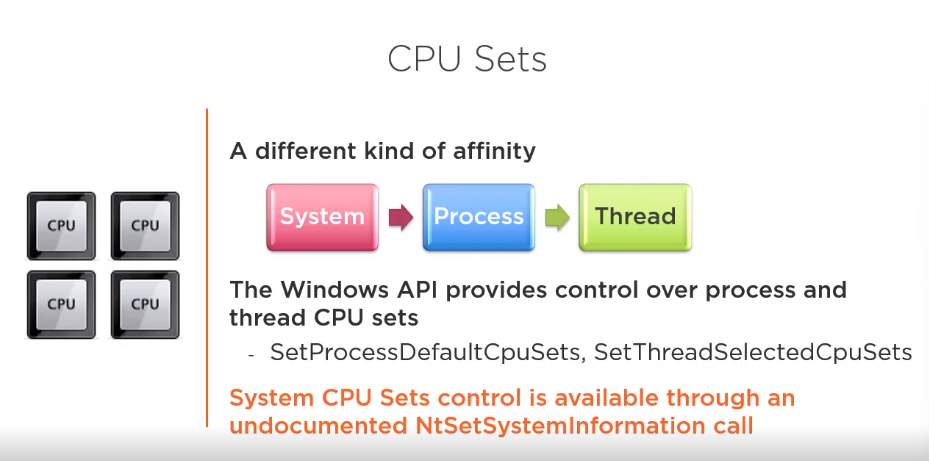

###  Base to know: https://www.youtube.com/watch?v=G_jcBrrYPAs

The Performance Price of Dynamic Memory in C++ - Ivica Bogosavljevic - [CppNow 2021]
https://www.youtube.com/watch?v=LC4jOs6z-ZI

### Windows Internals 7th edition contains information on how to use NtSetSystemInformation.
With SetThreadSelectedCpuSets, you can set the CPU affinity of a thread different from what process has.
NtSetSystemInformation is used by Games
to make other processes not to compete with the game for certain processors.
Also can be found at https://github.com/zodiacon repo:

